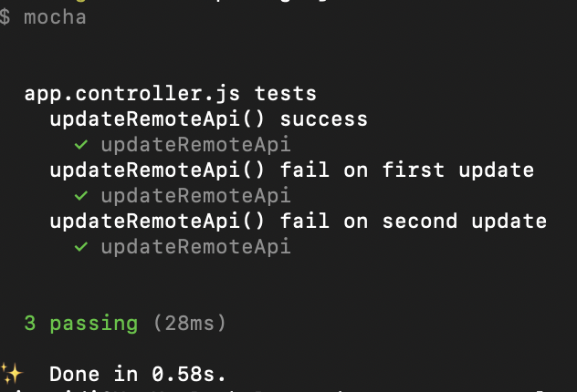

# Node.js Express Stateless App

A sample app to demostrate simple controller with unit tests

## Repository

https://github.com/mjunaidi/node-express-stateless-app

## How is this being created?

    yarn init

## Libraries

    yarn add express node-fetch
    yarn add -D mocha chai nock

---

## Running the test

    yarn test

---

## Controller

`./controller.js`

## Unit Test

`./controller.test.js`
